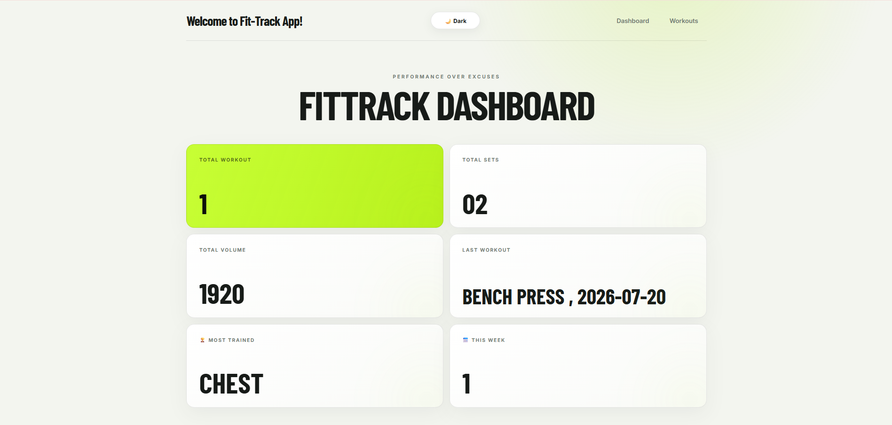
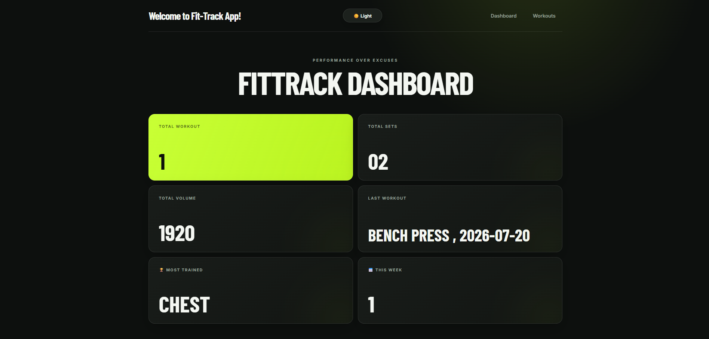
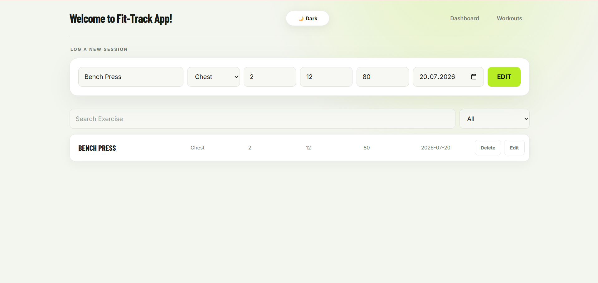
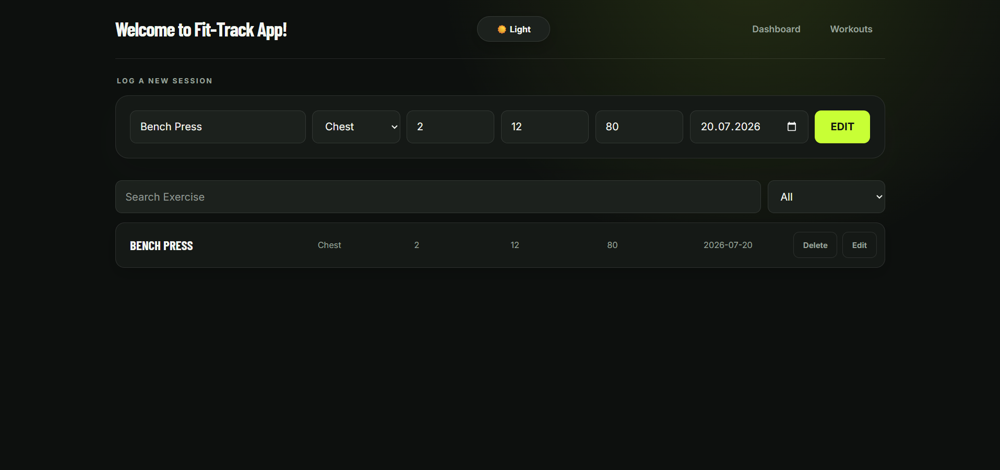

# FitTrack

[English](README.md) | [Türkçe](README.tr.md)

FitTrack is a modern fitness tracking application that helps you log your workouts and monitor your progress from a single dashboard. Built with React, it provides a fast, responsive, and user-friendly experience.

## Live Demo

https://fittrack-yigit.vercel.app/

## Features

- Add, edit, and delete workouts
- Search workouts by exercise name
- Filter workouts by muscle group
- View total workout, set, and volume statistics
- See your most recent workout
- Identify your most frequently trained muscle group
- Track the number of workouts completed this week
- Keep workout data between browser sessions
- Switch between light and dark themes
- Responsive design for mobile, tablet, and desktop

## Tech Stack

- React 19
- React Router
- Context API
- Local Storage
- Vite
- CSS

## Getting Started

Make sure Node.js is installed on your computer, then run:

```bash
git clone https://github.com/yigityilmaz16/fit-track.git
cd fit-track
npm install
npm run dev
```

Open the local address displayed in your terminal.

## Available Scripts

```bash
npm run dev
```

Starts the development server.

```bash
npm run build
```

Creates an optimized production build.

```bash
npm run preview
```

Previews the production build locally.

```bash
npm run lint
```

Runs the code quality checks.

## Project Structure

```text
src/
├── components/     # Form, card, list, and header components
├── context/        # Global workout state management
├── hooks/          # Reusable custom hooks
├── pages/          # Dashboard and Workouts pages
├── App.jsx         # Routing and theme management
├── index.css       # Global styles and theme colors
└── main.jsx        # Application entry point
```

## Data Storage

Workout data is stored in the browser's Local Storage. Your records remain available after refreshing or reopening the page, but they are limited to the current browser and device.

## 📸 Screenshots

### Dashboard (Light Mode)



### Dashboard (Dark Mode)



### Workouts Page (Light Mode)



### Workouts Page (Dark Mode)



## Possible Improvements

- Progress charts and visual reports
- Workout goals
- User accounts and cloud synchronization
- Exercise history and personal records
- Data export and backup

## License

This project was created for educational and personal use.

## Author

**Yiğit Yılmaz**

GitHub: [https://github.com/yigityilmaz16](https://github.com/yigityilmaz16)
